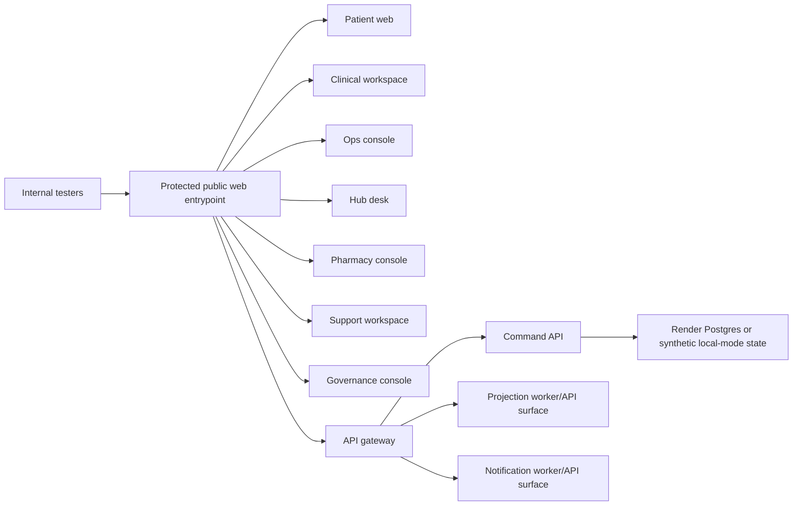

# Render Internal Deployment Strategy

This plan is for an internal team test deployment only.

## User Decisions Captured

- Use Render.
- Use GitHub.
- Use `main` for deployment.
- Update `main` from `dev` before deployment.
- Keep this internal for team testing, not official launch.
- No secrets are available now.
- Access must be secure but easy for nontechnical testers.
- Prefer writing plans now; create the actual deployment config in later sequential tasks.

## Recommended Method

Use a Render Blueprint (`render.yaml`) later, not direct one-off service creation.

Reason:

- This is a monorepo.
- There are seven frontends, five runtime services, multiple local infra emulators, workers, and shared packages.
- Render supports deploying individual apps from a monorepo as separate services, and Blueprints keep that reproducible.
- The project needs explicit internal access, private service boundaries, env vars, and likely a database decision.

## Recommended Internal Topology

Use one public tester entrypoint and keep infrastructure behind it.



The entrypoint can be a small Node web service in a later task. It should:

- require a shared internal password before showing anything;
- serve or link the seven built app surfaces;
- proxy API traffic to backend services where needed;
- avoid showing raw Render service URLs to testers.

Why not seven public static sites:

- Render static sites are convenient, but the team needs simple internal security.
- App-level password gating is easier to explain to nontechnical testers than separate URLs and access rules.
- Render inbound IP rules for web services/static sites require Enterprise, so IP allowlisting is not a reliable default unless the Render account plan supports it.

## Service Type Direction

| Resource | Render direction | Notes |
| --- | --- | --- |
| Internal tester entrypoint | `web` service | Public URL, password gate, build from repo root |
| API gateway | `web` or `pserv` | Public only if it owns the password/session gate; otherwise private behind entrypoint |
| Command API | `pserv` or worker-like private service | Needs `0.0.0.0`/`PORT` fix if HTTP reachable |
| Projection worker | `worker` if no inbound traffic, `pserv` if HTTP endpoints are required | Current code exposes HTTP health/routes |
| Notification worker | `worker` or `pserv` depending on test scope | Current code exposes HTTP health/routes |
| Adapter simulators | `pserv` or omit initially | Only deploy if internal tests need simulated integrations |
| Postgres | Render Postgres | Use only if team accepts Free expiration/limits or pays for persistence |
| Key Value/Valkey | Render Key Value if required | Free Key Value is in-memory only; avoid for important state |
| MinIO/object store | Do not deploy initially unless a test explicitly needs it | Render object storage equivalent is not automatic from current code |
| NATS | Omit initially unless live/event tests require it | Render has private services, but this needs explicit service design |

## Build Direction

Current root build is healthy:

```bash
pnpm install --frozen-lockfile
NX_TUI=false pnpm build
```

For a later Blueprint, prefer repo-root builds so shared workspace packages are available. Example direction, not final config:

```bash
pnpm install --frozen-lockfile
pnpm --dir apps/patient-web build
pnpm --dir apps/clinical-workspace build
pnpm --dir apps/ops-console build
pnpm --dir apps/hub-desk build
pnpm --dir apps/pharmacy-console build
pnpm --dir apps/support-workspace build
pnpm --dir apps/governance-console build
```

For Node services:

```bash
pnpm install --frozen-lockfile
pnpm --dir services/api-gateway build
pnpm --dir services/command-api build
pnpm --dir services/projection-worker build
pnpm --dir services/notification-worker build
pnpm --dir services/adapter-simulators build
```

## Required Render Readiness Code Changes

Current implementation status:

1. Root Node version pinning exists.
   - Local Node observed during the audit: `v24.10.0`.
   - GitHub workflows use Node 24.
   - `.node-version` pins Render-compatible Node `24.14.1`; `package.json` constrains Node to the Node 24 line.
2. HTTP services now support Render-compatible host/port settings.
   - Local defaults remain `127.0.0.1`.
   - Render can set `HOST=0.0.0.0`.
   - Service ports can use service-specific variables or Render `PORT`.
3. The first internal deployment scope uses one public `web` service: `services/internal-entrypoint`.
4. Backend/private services are omitted from the first Blueprint until a smoke-tested flow requires them.
5. Internal access gate exists in `services/internal-entrypoint`.
6. `render.yaml` defines the first internal Blueprint.

## Proposed Environment Variables

Non-secret:

- `NODE_ENV=production`
- `VECELLS_ENVIRONMENT=internal`
- `RELEASE_RING=internal`
- `OBSERVABILITY_SAMPLE_RATE=1.0` or lower if noisy
- `ENABLE_ASSISTIVE_CONTROL_LAB=false` unless the team explicitly tests it

Generated or dashboard-entered secret values:

- `INTERNAL_TEST_PASSWORD_HASH` or equivalent
- `SESSION_SECRET`
- any `*_SECRET_REF` required by enabled service paths

Port variables:

- For the one public Render web entrypoint, use Render `PORT`.
- For internal private services, use service-specific variables only after deciding service type.

## Known Render-Specific Risks

- Render Free web services spin down after idle time and lose local filesystem changes on redeploy/restart/spin-down.
- Render Free Postgres expires after 30 days and has 1 GB storage.
- Free web services cannot receive private network traffic, which matters if the architecture depends on free-tier private networking behavior.
- The current code has local emulator assumptions that do not automatically become managed Render services.
- Large frontend bundles may make first load slow for testers, especially after free-tier cold starts.

## Suggested Initial Internal Scope

First internal deployment should be a small, controlled preview:

- one protected entrypoint;
- all seven frontends available;
- synthetic/local fixture mode accepted;
- API gateway included only if a tester flow requires it;
- no real patient data;
- no external provider integrations;
- no official custom domain;
- no public launch messaging.
