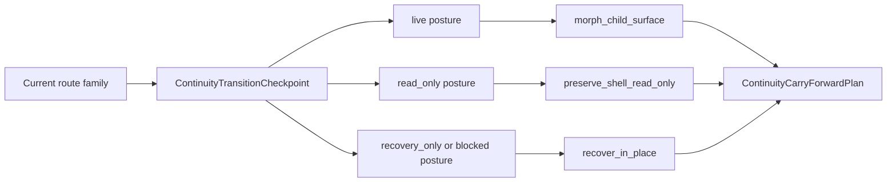

# 106 Shell Boundary And Restore Rules

Task: `par_106`

## Boundary States

- `reuse_shell`
- `morph_child_surface`
- `preserve_shell_read_only`
- `recover_in_place`
- `replace_shell`

## Same-Shell Continuity Diagram

## Carry-Forward Rules

When the same shell survives:

- preserve the navigation ledger
- preserve the status strip
- preserve `CasePulse`
- preserve the decision dock
- preserve mission-stack fold state
- preserve the selected anchor when the candidate route still supports it
- freeze the selected anchor instead of clearing it when runtime posture downgrades to `read_only`
- focus the recovery boundary notice only when runtime posture suppresses ordinary calm

## Restore Rules

The restore plan persists:

- shell slug
- return route-family ref
- selected anchor
- fold state
- runtime scenario
- dominant action label

Browser history is not authoritative continuity. The persisted restore payload is the shell’s stable refresh and return memory.

## Fold And Unfold

`mission_stack` is treated as the same shell epoch. Fold or unfold may not:

- drop the active anchor
- discard the current decision dock
- clear the return route
- imply a new mobile-only shell

## Degraded Posture

`read_only`, `recovery_only`, and `blocked` posture remain shell-local surfaces. The shell does not redirect away or replace its own chrome just because runtime authority degraded.

## Traceability

- `blueprint/platform-frontend-blueprint.md#167`
- `blueprint/platform-frontend-blueprint.md#170`
- `blueprint/platform-frontend-blueprint.md#172`
- `blueprint/platform-frontend-blueprint.md#181`
- `blueprint/platform-frontend-blueprint.md#531`
- `blueprint/platform-frontend-blueprint.md#558`
- `blueprint/platform-frontend-blueprint.md#583`
- `blueprint/forensic-audit-findings.md#Finding 86`
- `blueprint/forensic-audit-findings.md#Finding 120`
