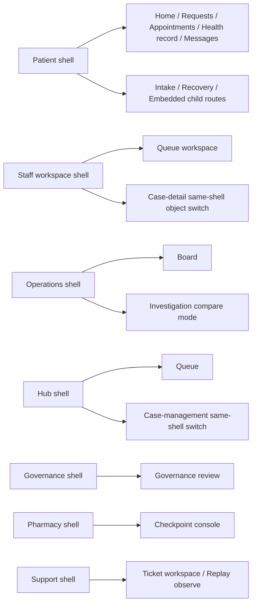

# 106 Shell Family Ownership And Route Residency

Task: `par_106`

## Ownership Rule

Each audience shell now publishes one explicit ownership contract and only the route families named by that contract may render as resident members of that shell. Child routes remain same-shell members only when their residency is declared as:

- `resident_root`
- `same_shell_child`
- `same_shell_object_switch`
- `bounded_stage`

## Ownership Diagram

## Residency Notes

- Patient child work stays inside the patient shell, including intake, secure-link recovery, and embedded-channel posture.
- Staff case switching remains a same-shell object switch so queue continuity and dock focus survive.
- Operations investigation remains inside the same shell and may widen to `three_plane` only during compare or blocker review.
- Hub options and case-management routes share one pinned candidate state.
- Governance keeps scope, diff, and approval rails on one shell continuity key.
- Pharmacy keeps checkpoint, validation, and decision posture in one shell-local frame.

## Support Extension

`support-workspace` is not one of the six primary audience targets named in prompt `106`, but the app already exists in the scaffold and the shared contract batch explicitly includes the support blueprint. The implementation therefore keeps support on the same shared framework rather than leaving one shipped audience shell on the legacy placeholder substrate.

## Source-Coupled Data

- [shell_family_ownership_matrix.csv](/Users/test/Code/V/data/analysis/shell_family_ownership_matrix.csv)
- [shell_route_residency_map.json](/Users/test/Code/V/data/analysis/shell_route_residency_map.json)
- [persistent_shell_contracts.json](/Users/test/Code/V/data/analysis/persistent_shell_contracts.json)

## Traceability

- `blueprint/platform-frontend-blueprint.md#ShellFamilyOwnershipContract`
- `blueprint/platform-frontend-blueprint.md#3576`
- `blueprint/patient-portal-experience-architecture-blueprint.md#186`
- `blueprint/staff-workspace-interface-architecture.md`
- `blueprint/operations-console-frontend-blueprint.md`
- `blueprint/governance-admin-console-frontend-blueprint.md`
- `blueprint/pharmacy-console-frontend-architecture.md`
- `blueprint/phase-5-the-network-horizon.md`
