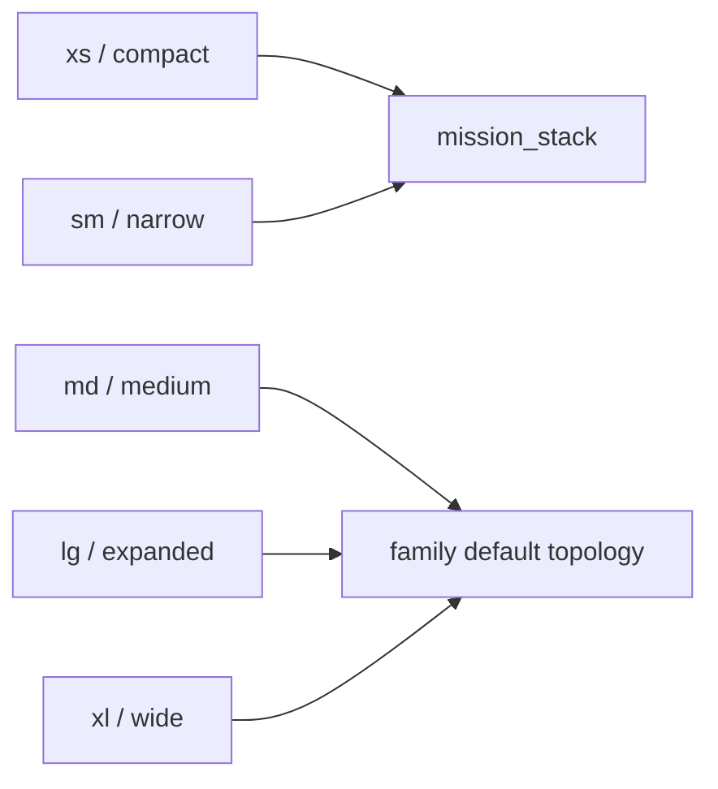
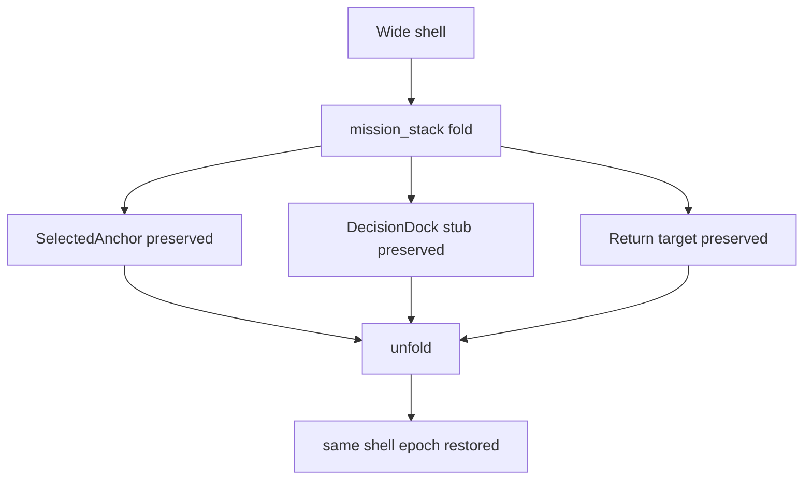

# 106 Shell Responsive Topology And Motion

Task: `par_106`

## Topology Rule

- patient defaults to `focus_frame`
- staff, support, operations, hub, and pharmacy default to `two_plane`
- governance defaults to `three_plane`
- `mission_stack` is the only narrow-screen fold

`xs` and `sm` resolve to `mission_stack` for every shell family. `md`, `lg`, and `xl` restore the shell family’s governed default topology.

## Breakpoint Diagram

## Motion Law

- hover and focus cues: `120ms`
- pane reveal and same-shell child morph: `180ms`
- shell settle and fold or unfold: `240ms`
- overlays and drawers: `320ms` max
- motion distances stay within the `4 / 8 / 12px` lattice
- reduced motion preserves causal order and focus movement without alternative route flow

## Shell Width Targets

- patient: open center column plus bounded support region
- staff: `320-360px` workboard, `680-880px` task canvas, `352-400px` decision rail
- operations: governed health canvas with optional lower or right intervention rail
- hub: `320px` queue plane, `560-760px` options plane, `352-400px` comms rail
- governance: `280px` scope rail, `720-960px` diff canvas, `352-400px` approval rail
- pharmacy: `280-320px` lane list, fluid checkpoint board, `352-400px` validation rail

## Fold Diagram

## Source-Coupled Data

- [shell_topology_breakpoint_matrix.csv](/Users/test/Code/V/data/analysis/shell_topology_breakpoint_matrix.csv)
- [persistent_shell_contracts.json](/Users/test/Code/V/data/analysis/persistent_shell_contracts.json)

## Traceability

- `blueprint/design-token-foundation.md#85`
- `blueprint/design-token-foundation.md#96`
- `blueprint/ux-quiet-clarity-redesign.md#171`
- `blueprint/ux-quiet-clarity-redesign.md#357`
- `blueprint/canonical-ui-contract-kernel.md#130`
- `blueprint/canonical-ui-contract-kernel.md#154`
- `blueprint/canonical-ui-contract-kernel.md#261`
