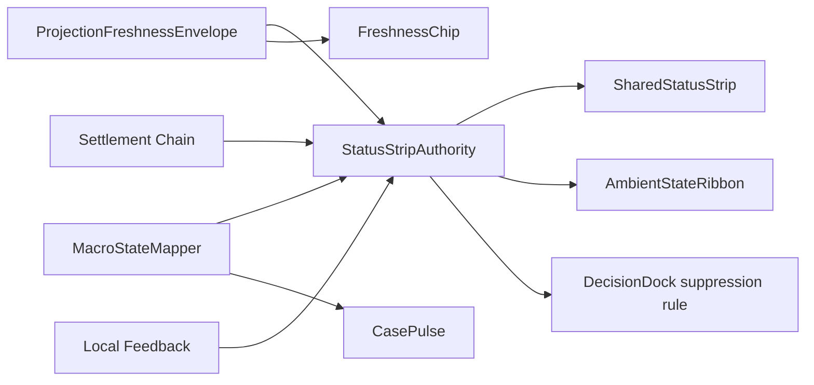

# par_107 Status Arbitration and Freshness Law

## Arbitration Order

The shared strip resolves exactly one shell-level winner at a time:

1. blocked or recovery-only truth
2. stale or review-required truth
3. pending external confirmation
4. local acknowledgement or processing acceptance
5. authoritative settlement
6. ordinary macrostate summary

This keeps `CasePulse`, the strip, and the dock from disagreeing when a shell is stale, frozen, or waiting on external confirmation.

## Freshness Law

- Transport health is advisory input only.
- `projectionFreshnessState = fresh` is illegal when `actionabilityState != live`.
- `transportState = live` is not enough to render "Fresh truth".
- When `ProjectionFreshnessEnvelope` falls to `stale_review` or `blocked_recovery`, the strip must override local save or processing language in the same render pass.
- Shell-level calmness may stay quieter than a localized region only when the current shell-level envelope still proves the dominant action, selected anchor, and shell interpretation are safe.

## Freshness / Actionability Matrix

| projectionFreshnessState | actionabilityState | allowed chip language | shell outcome |
| --- | --- | --- | --- |
| `fresh` | `live` | `Fresh truth` | ordinary integrated strip |
| `updating` | `guarded` | `Guarded update` | integrated strip, no calm success |
| `stale_review` | `frozen` | `Stale review` | review-first integrated strip |
| `blocked_recovery` | `recovery_only` | `Recovery only` | promoted banner |

## Accessibility Rule

`FreshnessAccessibilityContract` requires the same posture visually and semantically. The implementation therefore maps:

- `polite` live announcements for quiet-pending and ordinary local acknowledgement
- `assertive` live announcements for stale review, blocked truth, or recovery-required posture

## Source Refs

- `blueprint/platform-frontend-blueprint.md#1.1F StatusStripAuthority`
- `blueprint/platform-frontend-blueprint.md#1.7A ProjectionFreshnessEnvelope`
- `blueprint/accessibility-and-content-system-contract.md#FreshnessAccessibilityContract`
- `blueprint/ux-quiet-clarity-redesign.md#StatusStripAuthority`
