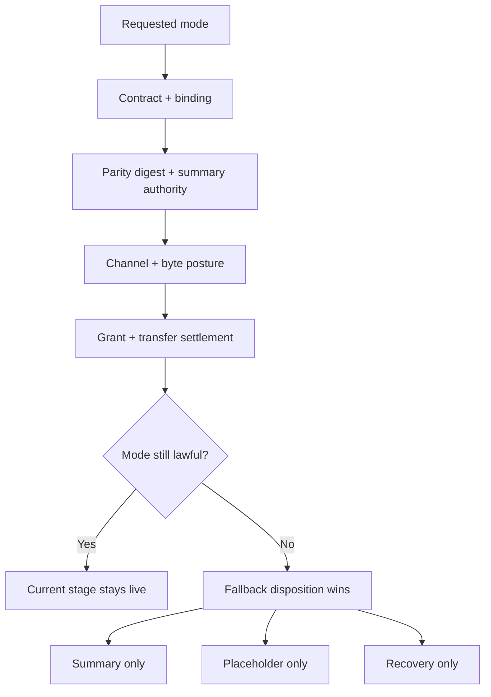

# par_109 Artifact Mode Truth And Handoff Rules

## Mode Truth

The shared adapter resolves one `ArtifactModeTruthProjection` from:

- `ArtifactPresentationContract`
- `ArtifactSurfaceBinding`
- `ArtifactParityDigest`
- `ArtifactSurfaceContext`
- `ArtifactTransferSettlement`
- `ArtifactFallbackDisposition`
- `OutboundNavigationGrant`

The adapter never infers capability from file name, mime type, or browser optimism alone.

## Requested Mode To Current Stage

| Requested mode | When it stays live | When it downgrades |
| --- | --- | --- |
| `structured_summary` | Always, unless recovery posture wins | Never leaves the shell |
| `governed_preview` | Inline preview policy, byte posture, parity, and channel all agree | Falls back to `structured_summary`, `placeholder_only`, or `recovery_only` |
| `download` | Byte delivery remains lawful and secondary | Summary remains primary if bytes are blocked |
| `print_preview` | Print contract, channel posture, and active grant all match | Expired or blocked grant degrades in place |
| `external_handoff` | Grant stays route-scoped, destination-scrubbed, and continuity-safe | Summary remains primary and handoff stays blocked |

## Handoff Rules

Handoff posture is one of:

- `secondary`: handoff is lawful but not active
- `armed`: the current grant, anchor, and return target still match the tuple
- `blocked`: grant, channel, or continuity posture no longer permits departure

The shell keeps the initiating anchor visible until either:

1. `ArtifactTransferSettlement.authoritativeTransferState` resolves, or
2. fallback posture wins and the shell stays in place

## Artifact Mode Truth Diagram

Diagram fallback:

- Contract and binding define the ceiling.
- Parity digest decides whether the summary can look verified or only provisional.
- Channel and byte posture decide whether preview can stay in-shell.
- Grant and transfer settlement decide whether print or handoff can arm.
- If any of those drifts, the shell downgrades in place.

## Current Examples

| Example | Requested mode | Current mode | Handoff posture | Return truth |
| --- | --- | --- | --- | --- |
| Appointment confirmation | `governed_preview` | `governed_preview` | `secondary` | `return_safe` |
| Record result summary | `governed_preview` | `governed_preview` | `secondary` | `return_safe` |
| Embedded evidence pack | `governed_preview` | `structured_summary` | `blocked` | `return_safe` |
| Readiness handoff summary | `external_handoff` | `structured_summary` | `armed` | `return_safe` |
| Recovery report | `print_preview` | `recovery_only` | `blocked` | `return_blocked` |
| Large attachment | `governed_preview` | `placeholder_only` | `secondary` | `return_safe` |

## Assumptions

- `ASSUMPTION_ARTIFACT_EMBEDDED_PRINT_BLOCKED`: embedded posture fails closed rather than probing for host-specific print support.
- `ASSUMPTION_ARTIFACT_DOWNLOAD_REMAINS_SECONDARY`: download remains secondary even when byte delivery is available.
- `ASSUMPTION_ARTIFACT_HANDOFF_SUMMARY_PRIMARY`: handoff does not replace the current summary as the primary shell experience.

## Source Traceability

- `prompt/109.md#Implementation_instructions`
- `blueprint/platform-frontend-blueprint.md#ArtifactPresentationContract`
- `blueprint/platform-frontend-blueprint.md#ArtifactSurfaceContext`
- `blueprint/platform-frontend-blueprint.md#ArtifactTransferSettlement`
- `blueprint/platform-frontend-blueprint.md#OutboundNavigationGrant`
