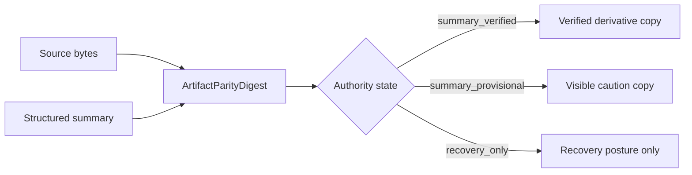
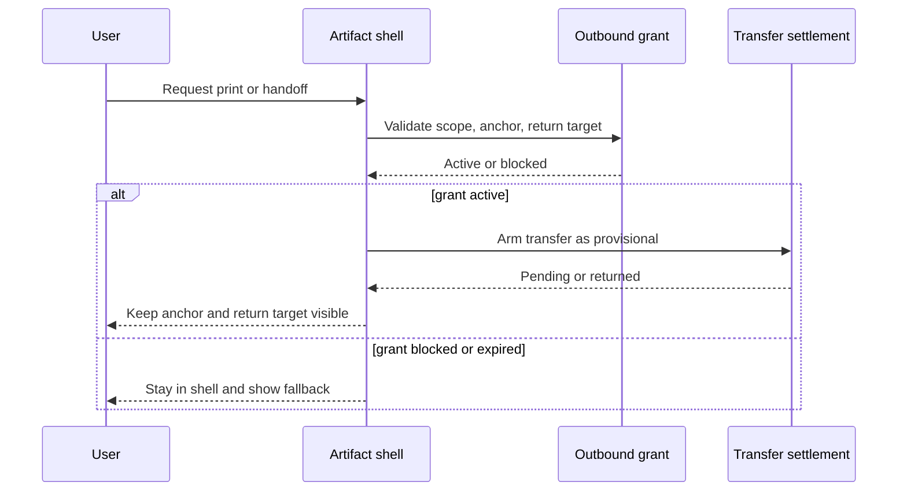

# par_109 Artifact Parity And Return Safety

## Parity Law

The shell keeps parity visible beside the summary, not inside a menu.

Parity states exercised in `par_109`:

- `summary_verified`
- `parity_stale`
- `summary_only` fallback driven by embedded posture
- `recovery_only` after expired print grant

Authority states exercised in `par_109`:

- `summary_verified`
- `summary_provisional`

## Parity And Source Authority Diagram

Diagram fallback:

- Source bytes and structured summary are compared through one `ArtifactParityDigest`.
- `summary_verified` allows verified summary copy.
- `summary_provisional` requires visible caution before preview is trusted.
- `recovery_only` suppresses richer artifact posture.

## Return-safe Continuity

Return-safe continuity needs the same:

- route family
- continuity key
- selected anchor
- return target
- scoped grant

If any of those drift, the shell stays in place and degrades through fallback posture instead of handing users into browser history ambiguity.

This section is the repository record for Outbound navigation and return safety under the shared artifact shell.

## Outbound Navigation And Return Diagram

Diagram fallback:

- User requests print or handoff.
- The shell validates grant scope against the same anchor and return target.
- Active grant keeps transfer provisional until settlement truth resolves.
- Blocked or expired grant keeps the shell in place.

## Return-safe Matrix

| Example | Grant state | Return truth | Result |
| --- | --- | --- | --- |
| Appointment confirmation | `active` | `return_safe` | Handoff remains secondary but lawful |
| Readiness handoff summary | `active` | `return_safe` | Pending handoff keeps same-shell continuity visible |
| Recovery report | `expired` | `return_blocked` | Print degrades in place to recovery |

## DOM Markers

The shared artifact shell publishes stable DOM markers for:

- `continuity-key`
- `selected-anchor`
- `artifact-mode`
- `parity-digest`
- `handoff-posture`
- `recovery-posture`

These markers are used by the new Playwright regression harness.

## Source Traceability

- `prompt/109.md#Verification_requirements`
- `blueprint/platform-frontend-blueprint.md#ArtifactParityDigest`
- `blueprint/platform-frontend-blueprint.md#ArtifactTransferSettlement`
- `blueprint/platform-frontend-blueprint.md#OutboundNavigationGrant`
- `blueprint/platform-frontend-blueprint.md#8-step artifact rendering algorithm`
