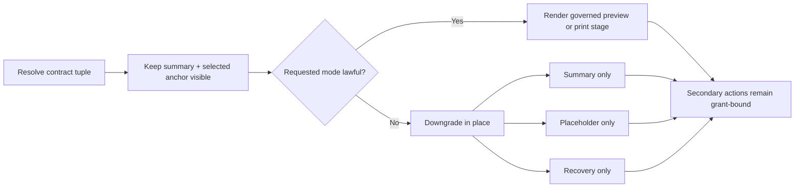

# par_109 Artifact Presentation Shell

## Purpose

`par_109` publishes one governed artifact shell for Phase 0. The shell keeps every document-like surface summary-first, preserves the initiating anchor and return target, and arms preview, download, print, and external handoff only when the current contract tuple keeps those actions lawful.

The shared `ArtifactSurfaceFrame` owns that shell layout, while `ArtifactStage` owns the current in-shell artifact mode.

The shared shell now covers:

- appointment confirmations
- record result summaries
- governance evidence packs
- recovery reports
- large record attachments

## Shell Composition

The artifact shell follows one fixed composition:

1. left summary rail, anchored to the initiating card, row, or timeline event
2. center `ArtifactStage`, which can render `structured_summary`, `governed_preview`, `print_preview`, `placeholder_only`, or `recovery_only`
3. right rail with parity, source authority, grant posture, and secondary actions
4. lower transfer strip with anchor retention, mode truth, transfer settlement, and return target state

The shell intentionally avoids:

- raw blob URLs as first-class UX
- detached print routes
- export-only pages that drop continuity
- parity claims hidden behind generic freshness copy

## Contract Surface

| Object | Shell responsibility | Current implementation note |
| --- | --- | --- |
| `ArtifactPresentationContract` | States whether preview, download, print, and handoff can ever arm | Implemented as typed contract data inside `artifact-shell.tsx` |
| `ArtifactSurfaceBinding` | Binds route family, selected anchor, fallback rules, and required parity posture | Each specimen publishes route-specific binding rows in `artifact_surface_binding_matrix.csv` |
| `ArtifactParityDigest` | Makes summary/source parity visible next to the summary | Rendered in the right rail and published in `artifact_parity_digest_examples.json` |
| `ArtifactSurfaceContext` | Keeps continuity key, return target, channel posture, and requested mode explicit | Drives the truth adapter and stage datasets |
| `ArtifactTransferSettlement` | Prevents optimistic click state from implying success | Lower strip stays provisional until authoritative settlement resolves |
| `ArtifactFallbackDisposition` | Degrades in place to summary, placeholder, or recovery | Embedded, expired-grant, and large-artifact specimens exercise this |
| `OutboundNavigationGrant` | Keeps departure route-scoped and return-safe | Grant matrix publishes active and expired examples |

## Rendering Law

Diagram fallback:

- Resolve contract, binding, parity digest, context, transfer settlement, and grant.
- Keep the summary rail and selected anchor visible before any richer surface.
- If the requested mode is no longer lawful, stay in the shell and degrade to summary, placeholder, or recovery.
- Secondary actions remain secondary even when preview is available.

## Specimen Coverage

| Specimen | Requested mode | Current stage | Governing outcome |
| --- | --- | --- | --- |
| Appointment confirmation | `governed_preview` | `governed_preview` | Verified parity keeps full governed preview available |
| Record result summary | `governed_preview` | `governed_preview` | Preview remains available, but parity is visibly provisional |
| Release evidence pack in embedded host | `governed_preview` | `structured_summary` | Embedded posture fails closed to summary-only |
| Readiness handoff summary | `external_handoff` | `structured_summary` | Handoff is secondary, grant-bound, and return-safe |
| Recovery report | `print_preview` | `recovery_only` | Expired print grant downgrades in place to recovery |
| Record attachment | `governed_preview` | `placeholder_only` | Large bytes swap preview for a governed placeholder |

## Gap Handling

- `GAP_RESOLUTION_ARTIFACT_COPY_EMBEDDED_SUMMARY_ONLY`: embedded preview ambiguity fails closed to summary-first copy.
- `GAP_RESOLUTION_ARTIFACT_COPY_TRANSFER_PROVISIONAL`: click, dialog, and spawned-tab feedback stay provisional until settlement truth resolves.
- `GAP_RESOLUTION_ARTIFACT_COPY_LARGE_PREVIEW_PLACEHOLDER`: large artifacts prefer governed placeholder posture over spinner-only preview.

## Follow-on Dependencies

- `FOLLOW_ON_DEPENDENCY_ARTIFACT_ROUTE_BINDINGS_PATIENT_RECORDS`: live route families plug the shared shell into seed routes later.
- `FOLLOW_ON_DEPENDENCY_ARTIFACT_RUNTIME_GRANTS`: runtime publication, route guards, and telemetry replace the mock grants without changing shell law.

## Source Traceability

- `prompt/109.md`
- `prompt/shared_operating_contract_106_to_115.md`
- `blueprint/platform-frontend-blueprint.md#1.19 ArtifactSurfaceFrame`
- `blueprint/platform-frontend-blueprint.md#1.19A ArtifactStage`
- `blueprint/platform-frontend-blueprint.md#ArtifactPresentationContract`
- `blueprint/platform-frontend-blueprint.md#ArtifactSurfaceBinding`
- `blueprint/platform-frontend-blueprint.md#ArtifactFallbackDisposition`
