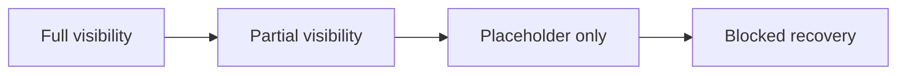

# 110 Degraded Mode And Placeholder Grammar

## Grammar Rules

The posture system distinguishes degraded truth from absent truth.

1. `empty` means nothing needs attention right now.
2. `sparse` means only minimal but meaningful summary remains.
3. `partial_visibility` means some safe summary is visible and some governed structure is withheld.
4. `placeholder_only` means the shell knows the object and must reserve its footprint, but the governed body is not allowed to render.
5. `calm_degraded` means the shell stays calm while ordinary reassurance or writable posture is explicitly suppressed.
6. `blocked_recovery` and `bounded_recovery` always preserve context and point to one dominant safe action.

## Placeholder And Visibility Diagram

Summary:
Visibility can narrow without changing shell identity. As visibility narrows, the shell keeps the strongest safe summary, preserves the selected anchor, and never renders a calmer or more interactive state than the current envelope allows.

Fallback matrix:

| Posture | Visible summary | Withheld structure | Placeholder rule |
| --- | --- | --- | --- |
| `partial_visibility` | safe summary rows | hidden fields or masked rows | reserve withheld rows as explicit governed blanks |
| `placeholder_only` | identity and safe summary | full body or preview | preserve truthful structure so later reveal does not jump |
| `calm_degraded` | same shell summary | reassurance or composer | suppress ordinary reassurance, not structure |
| `blocked_recovery` | last safe summary | further mutation path | use recovery card, not generic error art |

## Copy Rules

| Posture | Required sentence | Forbidden sentence |
| --- | --- | --- |
| `loading_summary` | “The current summary stays visible while details catch up.” | “Loading everything…” |
| `empty` | “Nothing needs action here right now.” | “Something went wrong.” |
| `sparse` | “Only the remaining watchpoints are shown.” | “No data available.” |
| `partial_visibility` | “Some details are withheld; the safe summary remains visible.” | “Everything is up to date.” |
| `stale_review` | “This view needs review before you act.” | “Fresh and ready.” |
| `blocked_recovery` | “Recovery is required before you continue.” | “Refresh to try again later.” |
| `read_only` | “This view remains visible, but changes are fenced.” | “Edit now.” |
| `placeholder_only` | “The structure is reserved while the governed body remains withheld.” | “Preview loading…” |
| `calm_degraded` | “The summary remains visible while reassurance is suppressed.” | “All clear.” |
| `bounded_recovery` | “One governed recovery path remains available.” | “Everything is blocked.” |

## Recovery Action Grammar

- put one dominant action in the same dominant-action zone as the shell
- keep secondary help below the dominant action
- preserve the anchor or last safe summary above the action cluster
- never place recovery instructions on a detached full-screen page while the same shell remains recoverable

## Accessibility And Truth

- live announcements must escalate only for blocked or recovery-dominant posture
- placeholder structure must remain traversable and labelled
- color is never the only carrier of caution or critical tone
- the preserved anchor must remain in the DOM even when the content region is loading, blocked, or partially visible
