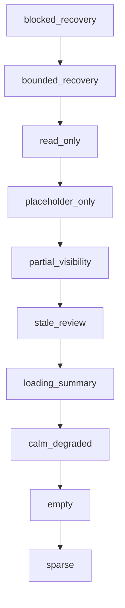

# 110 Posture State Precedence

## Governing Law

Route-local surfaces may supply copy and examples, but they may not redefine posture precedence. The shared resolver must win whenever visibility, freshness, actionability, and degraded-mode tuples disagree.

## Precedence Ladder

Summary:
The strongest unsafe or recovery-dominant tuple wins first. Calm states only apply after blocked, bounded-recovery, read-only, placeholder, partial-visibility, stale-review, and loading conditions have all failed.

Fallback list:

1. `blocked_recovery` wins when actionability is blocked, visibility is blocked, or freshness is `blocked_recovery`.
2. `bounded_recovery` wins when one governed resume path remains but full actionability is still suppressed.
3. `read_only` wins when the writable fence is closed but analytical review remains legal.
4. `placeholder_only` wins when the body is withheld but the shell still knows the object and its structure.
5. `partial_visibility` wins when some safe summary remains visible and some structure is masked.
6. `stale_review` wins when truth must be reviewed before action is safe.
7. `loading_summary` wins when a known structure is hydrating in place.
8. `calm_degraded` wins when continuity or reassurance is suppressed but recovery is not yet dominant.
9. `empty` wins only when nothing is needed here right now.
10. `sparse` wins only when a small but meaningful residual summary remains.

## Alias Normalization

| Alias | Canonical posture |
| --- | --- |
| `blocked`, `recovery` | `blocked_recovery` |
| `stale`, `degraded` | `stale_review` |
| `loading`, `refreshing_known_surface` | `loading_summary` |
| `governed_placeholder`, `visibility_withheld` | `placeholder_only` |
| `guarded_resume`, `recovery_with_context` | `bounded_recovery` |

## Anti-Patterns Rejected By The Resolver

- detached generic error pages while the same shell remains recoverable
- blank full-screen loaders when the shell already knows the object
- empty states used to hide blocked, read-only, or partial-visibility truth
- calm success copy while stale review, writable fence, or recovery posture still governs
