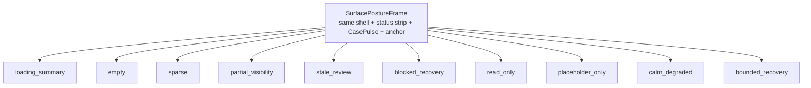

# 110 Surface Posture Frame Library

## Purpose

`par_110` introduces one shared posture vocabulary for non-happy-path frontend states. The package lives in `packages/surface-postures` and binds the shared shell, status strip, `CasePulse`, preserved anchor, placeholder footprint, and dominant recovery action into one same-shell posture contract.

The library exists to stop three recurrent failures:

1. blank or spinner-only same-shell refresh states
2. decorative empty states that hide blocked or partial truth
3. detached error pages that discard scope, anchor, and next safe action

## Taxonomy Diagram

Summary:
The root contract is always `SurfacePostureFrame`. `SurfaceStateFrame` localizes one posture class inside that shell without allowing route-level booleans to invent competing posture names.

Fallback table:

| Posture class | What remains visible | What changes |
| --- | --- | --- |
| `loading_summary` | shell, status strip, `CasePulse`, anchor | only known unresolved footprint hydrates |
| `empty` | scope, filters, return context | user learns why nothing is needed here |
| `sparse` | one calm residual summary | non-dominant density collapses |
| `partial_visibility` | safe summary | withheld structure stays explicit |
| `stale_review` | last stable board or summary | writable reassurance is suppressed |
| `blocked_recovery` | blocked object and last safe summary | one recovery path becomes dominant |
| `read_only` | analytical scope and anchor | mutation posture fails closed |
| `placeholder_only` | object identity and governed summary | withheld body keeps truthful footprint |
| `calm_degraded` | same shell and safe summary | ordinary reassurance stays suppressed |
| `bounded_recovery` | same shell and last safe summary | only one governed resume path remains |

## Shared Primitives

| Primitive | Responsibility |
| --- | --- |
| `SurfacePostureFrame` | same-shell wrapper with DOM markers, status strip, `CasePulse`, anchor, and recovery cluster |
| `SurfaceStateFrame` | precedence-resolved adapter that chooses the correct posture frame |
| `LoadingSummaryFrame` | known-object hydration without shell reset |
| `EmptyStateFrame` | calm no-work explanation with one safe next move |
| `SparseStateFrame` | residual meaning without decorative filler |
| `PartialVisibilityFrame` | safe summary plus explicit withheld structure |
| `StaleReviewFrame` | stale or degraded truth with freshness review posture |
| `BlockedRecoveryFrame` | blocked object with one dominant repair path |
| `ReadOnlyFrame` | analytical scope preserved while writable fence is closed |
| `PlaceholderOnlyFrame` | truthful placeholder structure for withheld content |
| `RecoveryActionCluster` | dominant safe action first, secondary help below |
| `DegradedModeNoticeStrip` | compact same-shell explanation of why ordinary reassurance is suppressed |

## DOM Markers

Every rendered posture frame emits these stable markers:

- `data-posture-class`
- `data-surface-state`
- `data-state-owner`
- `data-state-reason`
- `data-dominant-action`
- `data-dominant-recovery-action`
- `data-preserved-anchor`
- `data-visibility-state`
- `data-freshness-state`
- `data-actionability-state`
- `data-return-anchor`
- `data-mission-stack-fold-safe`

These markers are the shared automation and accessibility anchors for the gallery and the route-level reuse that follows in later tasks.

## Specimen Coverage

The package publishes ten specimens:

- patient `loading_summary`
- workspace `empty`
- hub `sparse`
- workspace `partial_visibility`
- operations `stale_review`
- pharmacy `blocked_recovery`
- governance `read_only`
- patient `placeholder_only`
- patient `calm_degraded`
- hub `bounded_recovery`

Those specimens are mirrored into `data/analysis/degraded_mode_examples.json` so the static gallery and browser regression checks stay aligned to the typed package surface.
