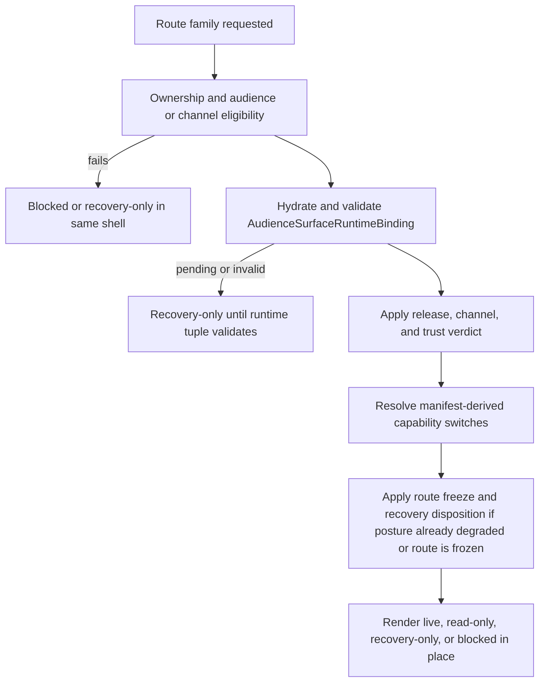
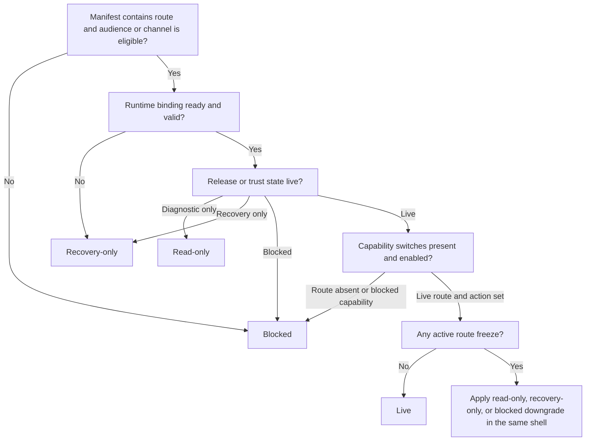

# 112 Browser Authority And Runtime Binding Precedence

The browser may not infer calm or writable posture from route imports, local cache, or component shape. `par_112` makes route authority derive from one ordered chain:

1. Route ownership and audience or channel eligibility
2. Runtime binding hydration and join validation
3. Release, channel, and trust posture
4. Manifest-derived capability switches
5. Route freeze and recovery disposition

## Hydration Law

- `binding_pending` is not neutral. The route remains downgraded until the runtime binding validates.
- `binding_invalid` is also not neutral. Mismatched audience surface, route-family membership, route contract, or publication ref keeps the shell in a governed recovery posture.
- `binding_ready` is necessary but still insufficient without release or trust clearance.

## Guard Decision Tree

## Notes

- Capability switches never upgrade a calmer or more degraded earlier posture.
- Freeze and recovery law may worsen the route after capability evaluation, but it may not make a blocked route appear live again.
- The same selected anchor remains the continuity reference unless the final posture becomes `blocked`.

## Source Refs

- `blueprint/platform-runtime-and-release-blueprint.md#AudienceSurfaceRuntimeBinding`
- `blueprint/platform-runtime-and-release-blueprint.md#FrontendContractManifest`
- `blueprint/platform-frontend-blueprint.md#WritableEligibilityFence`
- `blueprint/phase-0-the-foundation-protocol.md#4970`
