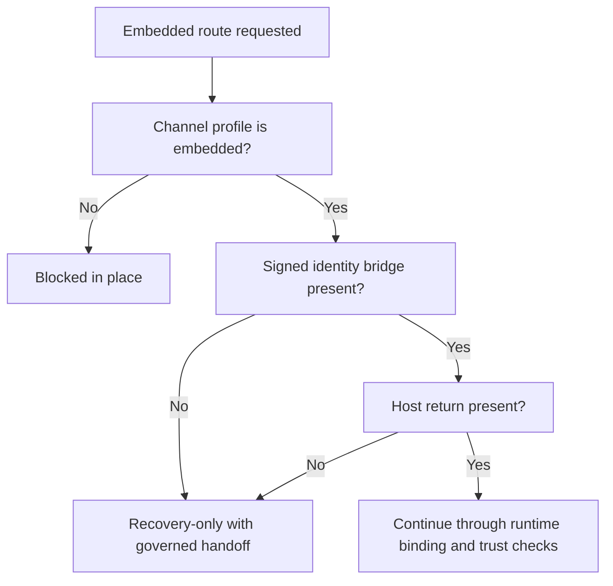
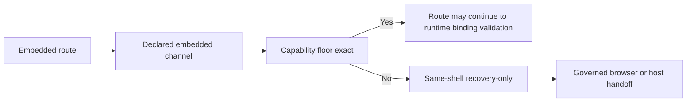

# 112 Embedded And Constrained Channel Guard Rules

`par_112` treats embedded and constrained delivery as explicit route-eligibility inputs. The browser may not infer support from user-agent strings, generic host presence, or a loosely detected bridge object.

## Embedded Rules

- Embedded patient recovery routes require explicit `embedded` channel context.
- The minimum embedded floor is `signed_identity_bridge` plus `host_return`.
- Missing embedded floor capability degrades to `recovery_only`, keeps the same shell, and exposes one governed handoff action.
- Embedded routes may still preserve the current header, selected anchor, and last safe summary while they downgrade.

## Constrained Browser Rules

- Telephony or proxy capture routes only remain live while the declared channel profile is `constrained_browser`.
- A standard browser visiting a constrained route is blocked before runtime binding or capability evaluation can reopen it.
- Constrained routes may still expose one recovery action such as `Resume capture safely`, but the route remains blocked until the correct channel re-enters.

## Same-Shell Downgrade Intent

- `embedded -> recovery_only`: preserve current route shell, expose governed handoff.
- `constrained_browser -> blocked` when wrong channel: preserve shell summary, expose return-safe resume action, do not redirect to home or login.

## Embedded Capability Downgrade Diagram

## Assumptions

- `ASSUMPTION_EMBEDDED_MINIMUM_CAPABILITIES`
- `ASSUMPTION_CONSTRAINED_BROWSER_CHANNEL_MATCH`

## Source Refs

- `blueprint/phase-7-inside-the-nhs-app.md`
- `blueprint/platform-frontend-blueprint.md`
- `blueprint/phase-4-the-booking-engine.md`
- `blueprint/phase-2-identity-and-echoes.md`
