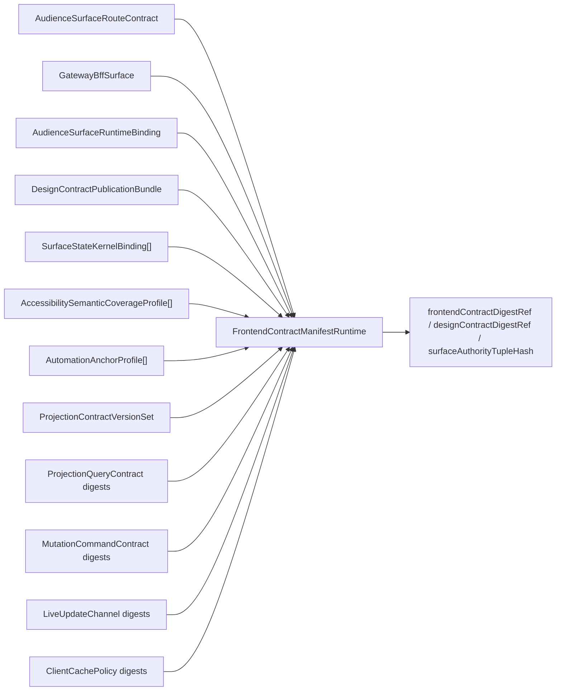

# 113 Frontend Contract Manifest Codegen

## Purpose

`par_113` turns the frontend manifest from a static analysis artifact into an executable shared-contract surface. The generator now emits one browser-consumable authority object per declared audience surface and route-family set, with digests for the read, write, stream, cache, design, and surface-authority joins.

## Generated Surface

- Example manifests published: `4`
- Route families covered in the curated pack: `5`
- Browser posture coverage: `publishable_live`, `read_only`, `recovery_only`, `blocked`
- Seed-route specimens bound to validated manifests: `4`

## Generator Law

- The generator binds route membership, gateway surface exposure, runtime publication, design publication, projection compatibility, accessibility coverage, automation anchors, and browser posture into one record.
- Frontend code may consume only the generated manifest object. It may not rebuild authority from route names, local feature flags, local ARIA, or cached payload shape.
- Digest joins are deterministic and sorted so array order cannot silently change contract identity.
- The generated runtime shape preserves the original `seq_050` manifest schema and adds runtime-specific digests and drift verdicts through `FrontendContractManifestRuntime`.

## Join Graph

## Runtime Shape

- `frontendContractDigestRef` joins route, gateway, query, mutation, live-channel, and cache digests.
- `designContractDigestRef` joins design publication, token layering, profile selection, kernel bindings, accessibility coverage, automation anchors, and state semantics.
- `surfaceAuthorityTupleHash` joins route publication, runtime binding, design bundle, runtime publication bundle, kernel propagation, accessibility coverage, projection compatibility, and browser posture.
- `driftState` gives one fail-closed summary for UI, validators, and observability.

## Mock-Now Boundaries

- `ASSUMPTION_113_USE_SEQ050_PROFILE_REFS_UNTIL_PAR111_AND_PAR114_ARE_PUBLISHED`
- `ASSUMPTION_113_RUNTIME_PUBLICATION_BUNDLES_REMAIN_MOCK_NOW`
- `FOLLOW_ON_DEPENDENCY_113_REBIND_TO_PAR111_ACCESSIBILITY_TUPLES`
- `FOLLOW_ON_DEPENDENCY_113_REBIND_TO_PAR114_AUTOMATION_PROFILES`

## Source Traceability

- `prompt/113.md`
- `prompt/shared_operating_contract_106_to_115.md`
- `blueprint/platform-runtime-and-release-blueprint.md#FrontendContractManifest`
- `blueprint/platform-runtime-and-release-blueprint.md#AudienceSurfaceRuntimeBinding`
- `blueprint/platform-frontend-blueprint.md#Shared IA rules`
- `blueprint/canonical-ui-contract-kernel.md#Canonical contracts`
