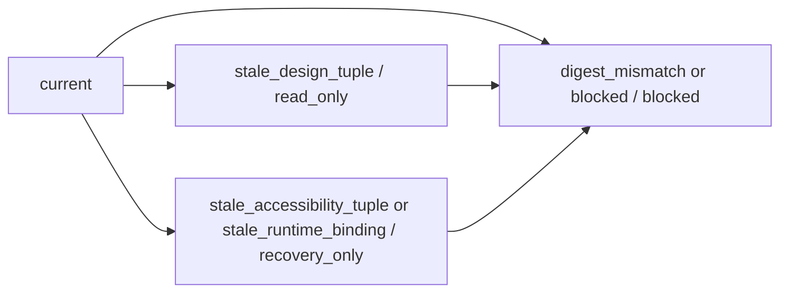

# 113 Manifest Drift And Fail-Closed Rules

## Purpose

`par_113` defines one explicit drift path for frontend browser authority. The manifest does not silently remain live when only some of its tuple members still match.

## Drift Ladder

- `current` preserves `publishable_live`
- `stale_design_tuple` demotes to `read_only`
- `stale_accessibility_tuple` demotes to `recovery_only`
- `stale_runtime_binding` demotes to `recovery_only`
- `digest_mismatch` blocks consumption
- `blocked` blocks consumption

## Fail-Closed Path

## Last Safe View Rule

- The observatory and later seed routes preserve the last safe manifest view when a selected scenario fails closed.
- Drift transitions add explicit markers instead of replacing the whole surface with a blank state.
- Rejected manifests still surface their issue codes and last safe manifest id, but route specimens may not consume them as active browser authority.

## Practical Guardrails

- Local route metadata may not override a rejected or degraded manifest.
- A stale design tuple never upgrades itself back to `publishable_live` based on component imports or visual similarity.
- A stale runtime binding never upgrades itself based on route reachability alone.
- Accessibility drift always wins over calm visual presentation.

## Source Traceability

- `prompt/113.md`
- `blueprint/platform-runtime-and-release-blueprint.md#FrontendContractManifest`
- `blueprint/platform-runtime-and-release-blueprint.md#AudienceSurfaceRuntimeBinding`
- `blueprint/platform-frontend-blueprint.md#Shared IA rules`
- `blueprint/forensic-audit-findings.md#Finding 91`
- `blueprint/forensic-audit-findings.md#Finding 118`
