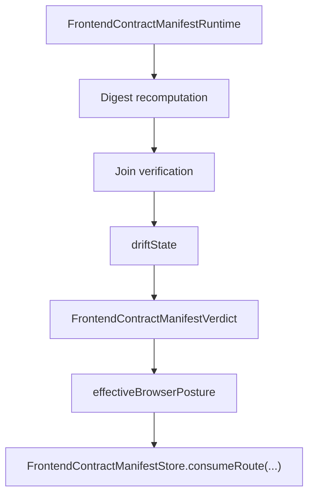

# 113 Manifest Runtime Validation

## Purpose

The runtime validator makes the browser consume the manifest as a governed authority tuple instead of a bag of refs. It recomputes digests, verifies the route/runtime/design joins, and returns one fail-closed verdict with the effective browser posture.

## Validation Outcomes

- `valid`: manifest is internally coherent and may remain `publishable_live`
- `degraded`: manifest is coherent enough to consume, but runtime, design, accessibility, or projection drift demotes posture to `read_only` or `recovery_only`
- `rejected`: required fields or digest joins are broken, or the tuple is blocked; the browser must not consume it as live authority

## Browser Authority Tuple

## Validator Rules

1. Reject missing required refs and empty required arrays.
2. Reject digest drift for the frontend contract, design contract, or surface-authority tuple.
3. Demote to `read_only` when design lint, runtime publication, parity, or projection compatibility drifts but the tuple is still consumable.
4. Demote to `recovery_only` when runtime binding or accessibility coverage drifts.
5. Reject and block when design lint, accessibility coverage, projection compatibility, runtime publication, or publication parity is blocked or withdrawn.

## Scenario Pack

- Validation scenarios: `6`
- `valid`: `1`
- `degraded`: `2`
- `rejected`: `3`

## Consumption Helpers

- `validateFrontendContractManifest(...)`
- `consumeValidatedFrontendContractManifest(...)`
- `FrontendContractManifestStore`
- `FrontendContractManifestStore.consumeRoute(...)`

These helpers force later seed routes to consume validated manifest data only. Rejected manifests throw instead of leaking partial authority into the shell.

## Source Traceability

- `prompt/113.md`
- `blueprint/platform-runtime-and-release-blueprint.md#FrontendContractManifest`
- `blueprint/platform-runtime-and-release-blueprint.md#AudienceSurfaceRuntimeBinding`
- `blueprint/platform-frontend-blueprint.md#Shared IA rules`
- `blueprint/accessibility-and-content-system-contract.md#Canonical accessibility and content objects`
