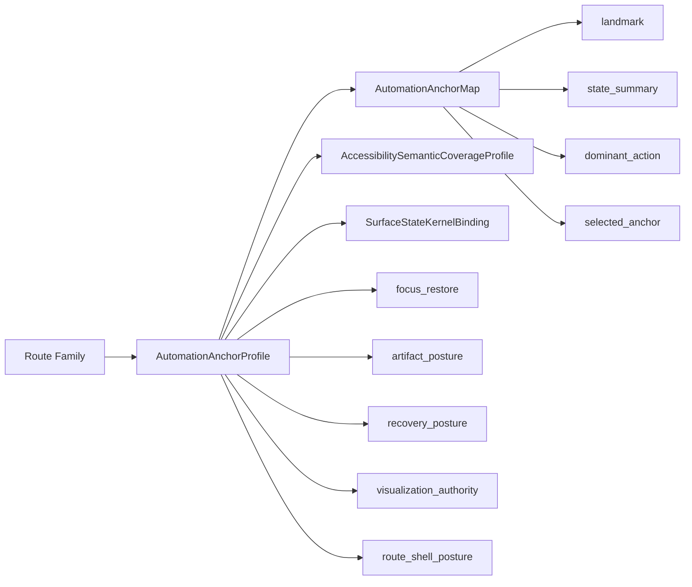
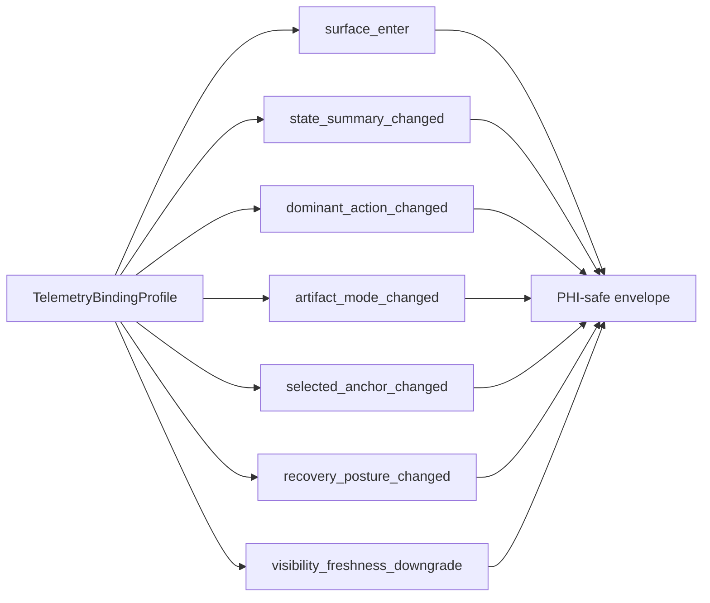

# Automation Anchor And UI Telemetry Vocabulary

Task: `par_114`  
Visual mode: `UI_Telemetry_Console`

## Purpose

Vecells now publishes one shared browser-visible vocabulary for automation and UI telemetry across shell, route, and posture specimens. This layer keeps Playwright, diagnostics, support replay, and future production sinks on the same names for:

- landmark
- state summary
- dominant action
- selected anchor
- focus restore
- artifact posture
- recovery posture
- visualization authority
- route and shell posture

The published machine-readable artifacts are:

- [automation_anchor_profile_examples.json](/Users/test/Code/V/data/analysis/automation_anchor_profile_examples.json)
- [automation_anchor_matrix.csv](/Users/test/Code/V/data/analysis/automation_anchor_matrix.csv)
- [ui_telemetry_vocabulary.json](/Users/test/Code/V/data/analysis/ui_telemetry_vocabulary.json)
- [ui_event_envelope_examples.json](/Users/test/Code/V/data/analysis/ui_event_envelope_examples.json)

## Published Shape

- `19` route-family anchor profiles are resolved from the published UI-kernel, accessibility, and shell tuples.
- `9` shared marker classes are emitted per route profile.
- `133` route-bound event bindings are published: `76` direct contract bindings and `57` bounded supplemental bindings.
- `6` diagnostics scenarios cover `shell_gallery`, `status_truth_lab`, `posture_gallery`, `route_guard_lab`, and the provisional `patient_seed_surrogate`.

## Automation-Anchor Map

## Telemetry Binding

## Operating Rules

- Route-local `data-testid` values are not the authority vocabulary. Shared selectors come from the published route-family marker classes.
- Supplemental event classes inherit the route-family telemetry prefix. The repo does not create a second namespace for diagnostics-only events.
- Repeated-instance targeting is subordinate to shared marker classes through `data-automation-instance-key`.
- `par_115` through `par_120` must consume this vocabulary without renaming any marker classes or event names.

## Gaps And Follow-On

- `GAP_RESOLUTION_AUTOMATION_ANCHOR_FOCUS_RESTORE_MARKER_V1`
- `GAP_RESOLUTION_AUTOMATION_ANCHOR_RECOVERY_POSTURE_MARKER_V1`
- `GAP_RESOLUTION_AUTOMATION_ANCHOR_VISUALIZATION_AUTHORITY_MARKER_V1`
- `GAP_RESOLUTION_AUTOMATION_ANCHOR_ROUTE_SHELL_POSTURE_MARKER_V1`
- `GAP_RESOLUTION_AUTOMATION_ANCHOR_REPEATED_INSTANCE_SELECTOR_SUBORDINATE_V1`
- `GAP_RESOLUTION_AUTOMATION_ANCHOR_SUPPLEMENTAL_UI_EVENT_CLASSES_V1`
- `GAP_RESOLUTION_AUTOMATION_ANCHOR_PATIENT_SEED_SURROGATE_V1`

Browser diagnostics surface: [114_ui_telemetry_diagnostics_console.html](/Users/test/Code/V/docs/architecture/114_ui_telemetry_diagnostics_console.html)
