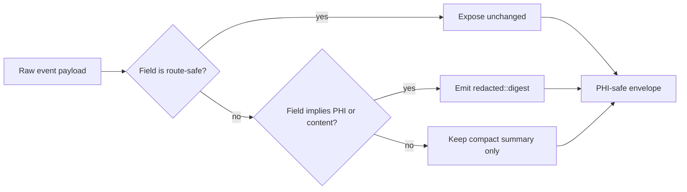

# DOM Marker And Event Envelope Rules

Task: `par_114`

## DOM Marker Rules

- Every specimen root publishes `data-automation-surface`, `data-route-family`, `data-shell-slug`, `data-automation-anchor-map-ref`, and `data-telemetry-binding-profile-ref`.
- Shared marker elements publish `data-automation-anchor-class` and `data-automation-anchor-ref`.
- Focus restore is published through `data-focus-restore-ref`; it is never inferred from browser history alone.
- Recovery posture is published through `data-recovery-posture`; writable state and route shell posture remain visible even when the surface is read-only or blocked.
- Visualization authority is published through `data-visualization-authority` so chart, table, and summary fallbacks stay on one browser-visible contract.

## Event Envelope Rules

- Event envelopes must carry route-family, shell, marker-ref, and posture vocabulary fields.
- Event envelopes must not expose person names, contact values, message bodies, note text, or attachment filenames directly.
- When a field widens PHI exposure, the diagnostics surface emits `redacted::<digest>` instead of the value.
- Supplemental event classes are bounded extensions of the published route-family prefix, not a second telemetry namespace.

## Disclosure Fence

## Required Envelope Vocabulary

- `surface_enter`
- `state_summary_changed`
- `selected_anchor_changed`
- `dominant_action_changed`
- `artifact_mode_changed`
- `recovery_posture_changed`
- `visibility_freshness_downgrade`

## Selector Discipline

- Playwright selectors must come from the shared marker vocabulary, for example `resolveSharedMarkerSelector(routeFamilyRef, markerClass)`.
- Instance keys may refine repeated rows, tabs, or cards, but only under a shared marker class.
- Debug overlays may display marker refs and payload digests, but never raw PHI or free-text excerpts.

## Assumption

- `ASSUMPTION_UI_TELEMETRY_DISCLOSURE_FENCE_SAFE_FIELDS_V1` keeps the allowed diagnostics field set narrow until runtime sinks are wired in the merge phase.
