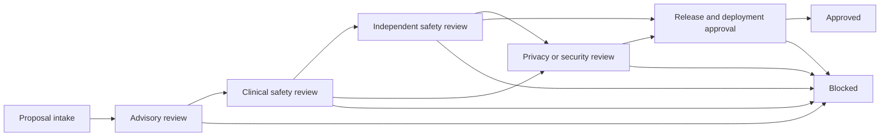

# 125 Release And Safety Approval Graph

The approval graph is the prose view of [`clinical_signoff_workflow_state_machine.json`](../../data/assurance/clinical_signoff_workflow_state_machine.json).

## Section A — `Mock_now_execution`

- The repo uses one explicit graph for advisory review, clinical safety review, independent safety review, privacy/security review, and release approval.
- Release candidate signoff stays blocked unless the reviewed candidate still matches the same `ReleaseApprovalFreeze`, `GovernanceReviewPackage`, `RuntimePublicationBundle`, `ReleasePublicationParityRecord`, `AssuranceSliceTrustRecord`, and `StandardsDependencyWatchlist`.

## Section B — `Actual_production_strategy_later`

- Real team names, deployer signoffs, and external onboarding evidence should extend this graph rather than replace it.
- Additional approver roles may be inserted only if the existing actor-separation and no-self-approval rules remain intact.

## Approval Graph

## Release Candidate Gate Requirements

| Gate id | Required ref | Why it blocks release |
| --- | --- | --- |
| GATE_125_RELEASE_FREEZE_CURRENT | REF_RELEASE_APPROVAL_FREEZE | ReleaseApprovalFreeze must be active and exact for the candidate scope. |
| GATE_125_RUNTIME_PUBLICATION_BUNDLE_CURRENT | REF_RUNTIME_PUBLICATION_BUNDLE | RuntimePublicationBundle must match the candidate under review. |
| GATE_125_RELEASE_PUBLICATION_PARITY_EXACT | REF_RELEASE_PUBLICATION_PARITY | ReleasePublicationParityRecord must still report exact parity for the candidate package. |
| GATE_125_ASSURANCE_SLICE_TRUST_COMPLETE | REF_ASSURANCE_SLICE_TRUST_RECORD | Required AssuranceSliceTrustRecord rows must remain trusted or bounded per the change class and route family. |
| GATE_125_GOVERNANCE_REVIEW_PACKAGE_CURRENT | REF_GOVERNANCE_REVIEW_PACKAGE | GovernanceReviewPackage must remain current for the same scope, baseline, and compiled bundle. |
| GATE_125_STANDARDS_WATCHLIST_CURRENT | REF_STANDARDS_DEPENDENCY_WATCHLIST | StandardsDependencyWatchlist must still be current for the reviewed candidate and not superseded by external change. |
| GATE_125_CHANNEL_FREEZE_COMPATIBLE | REF_CHANNEL_RELEASE_FREEZE_RECORD | Any affected channel family must have a compatible ChannelReleaseFreezeRecord before mutable posture is exposed. |
